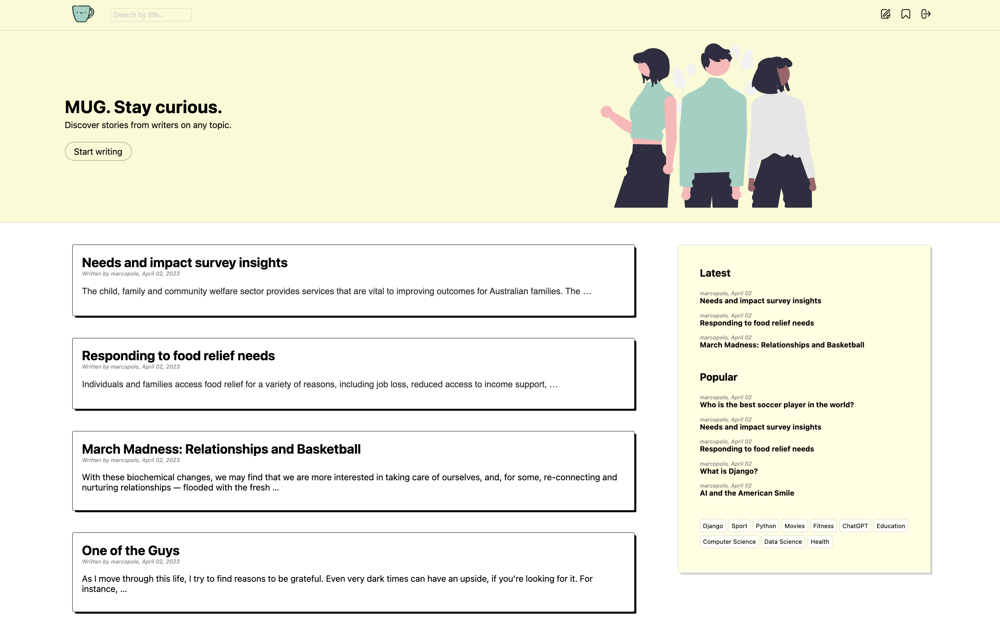

# MUG blogging-platform

Broadcast-style communications systems that enable authors to publish articles.

## Check it out!

[MUG project deployed to Render](https://mug-91nk.onrender.com/)

```shell
git clone https://github.com/bihunva/mug-blogging-platform
python3 -m venv venv
source venv/bin/activate
pip install -r requirements.txt
python manage.py runserver
```

# Features

* Authentication functionality for user
* Registered users can comment on posts
* Ability to add/remove posts to/from saved
* Registered users can publish their own posts

## Demo

